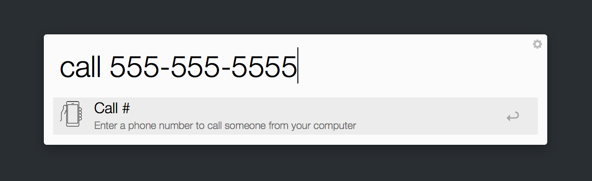

## Call Someone

This is a simple Alfred workflow that will allow you to call any phone number from your computer.

Simply use the `call` keyword and then send a phone number in as an argument.

> Note: Requires Yosemite and an iPhone

#### To Do

- Make it so that the number dials right away instead of requiring the user to click the "call" button again.
